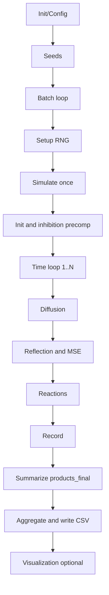

# 2D 酶级联模拟：数学理论与模拟方法解析
Language / 语言: [English](2d_model_theory.en.md) | [中文](2d_model_theory.md)

> 本文系统梳理当前 2D 酶级联模拟的物理建模、数学方程、随机数/蒙特卡洛机制、统计收敛与代码实现映射，便于复现、审阅与扩展。

- 主控入口与批处理：
  - [2D/main_2d_pipeline.m](../main_2d_pipeline.m)
  - [2D/modules/batch/run_batches.m](../modules/batch/run_batches.m)
  - [2D/modules/seed_utils/get_batch_seeds.m](../modules/seed_utils/get_batch_seeds.m)
- 单次模拟与核心物理：
  - [2D/modules/sim_core/simulate_once.m](../modules/sim_core/simulate_once.m)
  - [2D/modules/sim_core/init_positions.m](../modules/sim_core/init_positions.m)
  - [2D/modules/sim_core/diffusion_step.m](../modules/sim_core/diffusion_step.m)
  - [2D/modules/sim_core/boundary_reflection.m](../modules/sim_core/boundary_reflection.m)
  - [2D/modules/sim_core/reaction_step.m](../modules/sim_core/reaction_step.m)
  - [2D/modules/sim_core/precompute_inhibition.m](../modules/sim_core/precompute_inhibition.m)

  - [2D/modules/sim_core/record_data.m](../modules/sim_core/record_data.m)
- 可视化（事件图/轨迹等）：
  - [2D/modules/viz/plot_event_map.m](../modules/viz/plot_event_map.m)
  - [2D/modules/viz/plot_tracers.m](../modules/viz/plot_tracers.m)

---

## 1. 系统概述与建模假设

- 几何与边界
  - 2D 方形盒子，边长 L（默认 500 nm），中心存在半径 rp（默认 20 nm）的颗粒与膜厚 ft（默认 5 nm）的环区。
  - 边界条件：盒壁、颗粒表面为镜面反射（无吸收）。
- 物种与过程
  - 底物 S 随机扩散；GOx、HRP 固定位于膜区（MSE 模式）或分布于体相（bulk 模式）。
  - 级联反应：S -(GOx)-> I -(HRP)-> P。
  - 关键参数（默认值见配置）：
    - 扩散系数：D_bulk = 1000 nm²/s，D_film = 10 nm²/s。
    - 速率常数：k_cat,GOx = 100 s⁻¹，k_cat,HRP = 100 s⁻¹。
    - 拥挤抑制：范围 R_inhibit = 10 nm，饱和阈值 n_sat = 5，最大抑制 I_max = 0.8。
- 配置入口：
  - [2D/modules/config/default_config.m](../modules/config/default_config.m)
  - [2D/modules/config/interactive_config.m](../modules/config/interactive_config.m)

---

## 2. 连续体模型（PDE 视角）

反应-扩散方程在 2D 空间的形式（定性展示）：

**反应-扩散方程组**：
- ∂[S]/∂t = D ∇²[S] - k_GOx [S][GOx]
- ∂[I]/∂t = D ∇²[I] + k_GOx [S][GOx] - k_HRP [I][HRP]
- ∂[P]/∂t = D ∇²[P] + k_HRP [I][HRP]

说明：

- ∇² = ∂²/∂x² + ∂²/∂y²。
- 在 MSE 模式，[GOx] 与 [HRP] 等效集中在膜环区域（r ∈ [r_p, r_p + f_t]），呈强非均匀源项。
- 非线性、奇异边界导致解析解困难，因此采用随机粒子/蒙特卡洛方法进行数值近似。

---

## 3. 随机粒子模拟（蒙特卡洛 BD + 事件驱动）

本模型采用布朗动力学（Brownian Dynamics）离散扩散，配合固定步长的随机反应判定（τ-leaping 近似）。

### 3.1 扩散离散（Brownian step）

#### 理论

**布朗步进公式**：Δr = sqrt(2 D Δt) · η，其中 η ~ N(0, I₂)

代码对应：高斯位移叠加到粒子位置（bulk/film 选择 D）。

文件： [2D/modules/sim_core/diffusion_step.m](../modules/sim_core/diffusion_step.m)

### 3.2 边界与膜区约束

- 盒子与颗粒表面镜面反射：法向分量取反。
- MSE 模式：反应位点与可行相遇被限制在膜环 r ∈ [r_p, r_p + f_t]。
- 文件： [2D/modules/sim_core/boundary_reflection.m](../modules/sim_core/boundary_reflection.m)，膜环约束在 [2D/modules/sim_core/reaction_step.m](../modules/sim_core/reaction_step.m)

### 3.3 反应概率与事件采样（Gillespie 风格）

#### 单步反应概率

**反应概率公式**：p = 1 - exp(-k_eff · Δt)，其中 k_eff = k_cat · (1 - inhibition)

判定：采样 u ~ U(0,1)，若 u < p，则发生反应事件（S→I 或 I→P）。事件坐标：在相遇对（酶-底物）局部附近采样并记录，用于事件热力图。

文件： [2D/modules/sim_core/reaction_step.m](../modules/sim_core/reaction_step.m)

### 3.4 拥挤抑制（局部调制）

近邻半径内（R_inhibit）统计局部拥挤度 n_local，形成抑制权重：

**拥挤抑制公式**：inhibition = I_max × max(0, 1 - n_local / n_sat)

文件： [2D/modules/sim_core/precompute_inhibition.m](../modules/sim_core/precompute_inhibition.m)

### 3.5 数据累计与时间积分

- 速率（每步统计）：
  - r_GOx(t) = n_GOx,step / Δt
  - r_HRP(t) = n_HRP,step / Δt

- 产物曲线：
  - P(t) ≈ Σ r_HRP(t) · Δt

- 快照/分层/轨迹按配置选择性记录。

文件： [2D/modules/sim_core/record_data.m](../modules/sim_core/record_data.m)，汇总在 [2D/modules/sim_core/simulate_once.m](../modules/sim_core/simulate_once.m)

---

## 4. 批次蒙特卡洛统计与收敛

- 单批输出：最终产物数 `products_final`，以及轨迹/事件等。
- 多批次统计：独立种子下运行 M 次，估计期望与方差：

**蒙特卡洛统计公式**：
- μ̂ = (1/M) Σ_{m=1}^{M} P_m
- Var(μ̂) = σ² / M

- 建议：

  - 验证/调参阶段：M ≈ 5-10；
  - 报告/区间估计：M ≥ 30，并输出均值 ± 置信区间。

- 文件： [2D/modules/batch/run_batches.m](../modules/batch/run_batches.m)，种子策略见 [2D/modules/seed_utils/get_batch_seeds.m](../modules/seed_utils/get_batch_seeds.m)

---

## 5. 代码实现流程图（逻辑总览）

- 入口： [2D/main_2d_pipeline.m](../main_2d_pipeline.m)
- 单次模拟： [2D/modules/sim_core/simulate_once.m](../modules/sim_core/simulate_once.m)

---

## 6. 代码映射速查

- 主控与 IO
  - [2D/main_2d_pipeline.m](../main_2d_pipeline.m)：统一流程、可视化与报表
  - [2D/modules/batch/run_batches.m](../modules/batch/run_batches.m)：批次循环与结果聚合
  - [2D/modules/seed_utils/get_batch_seeds.m](../modules/seed_utils/get_batch_seeds.m)：种子策略
- 物理核心
  - [2D/modules/sim_core/simulate_once.m](../modules/sim_core/simulate_once.m)：单次模拟门面
  - [2D/modules/sim_core/init_positions.m](../modules/sim_core/init_positions.m)：初始位置
  - [2D/modules/sim_core/diffusion_step.m](../modules/sim_core/diffusion_step.m)：布朗扩散
  - [2D/modules/sim_core/boundary_reflection.m](../modules/sim_core/boundary_reflection.m)：边界/颗粒反射
  - [2D/modules/sim_core/reaction_step.m](../modules/sim_core/reaction_step.m)：反应事件与膜环约束
  - [2D/modules/sim_core/precompute_inhibition.m](../modules/sim_core/precompute_inhibition.m)：拥挤抑制
  - [2D/modules/sim_core/record_data.m](../modules/sim_core/record_data.m)：速率/曲线累计
- 可视化
  - [2D/modules/viz/plot_event_map.m](../modules/viz/plot_event_map.m)：空间事件图
  - [2D/modules/viz/plot_tracers.m](../modules/viz/plot_tracers.m)：粒子轨迹
  - 其它 plot_* 见 `modules/viz/`

---

## 7. 术语与参考

- Brownian Dynamics（布朗动力学）：通过 Δr = sqrt(2D Δt) η 离散维纳过程模拟扩散。
- Gillespie/τ-leaping：固定步长下用 p = 1 - exp(-k Δt) 近似事件发生概率。
- Smoluchowski 相遇理论：扩散控制反应的相遇率，在 2D/3D 下表达不同。
