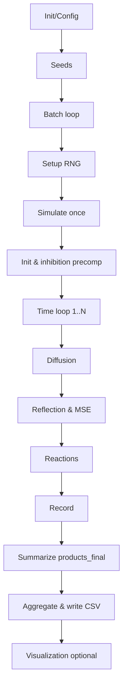

# 2D Enzyme Cascade Simulation: Theory and Algorithm
Language / 语言: [English](2d_model_theory.en.md) | [中文](2d_model_theory.md)

- Entrypoints and batching:
  - [main_2d_pipeline.m](../main_2d_pipeline.m)
  - [run_batches.m](../modules/batch/run_batches.m)
  - [get_batch_seeds.m](../modules/seed_utils/get_batch_seeds.m)
- Single run and core physics:
  - [simulate_once.m](../modules/sim_core/simulate_once.m)
  - [init_positions.m](../modules/sim_core/init_positions.m)
  - [diffusion_step.m](../modules/sim_core/diffusion_step.m)
  - [boundary_reflection.m](../modules/sim_core/boundary_reflection.m)
  - [reaction_step.m](../modules/sim_core/reaction_step.m)
  - [precompute_inhibition.m](../modules/sim_core/precompute_inhibition.m)
  - [record_data.m](../modules/sim_core/record_data.m)
- Visualization:
  - [plot_event_map.m](../modules/viz/plot_event_map.m)
  - [plot_tracers.m](../modules/viz/plot_tracers.m)

---

## 1. System Overview and Assumptions

- Geometry and boundaries
  - 2D square domain of side length $L$ (default $500\\,\\mathrm{nm}$); a central particle of radius $r_p$ (default $20\\,\\mathrm{nm}$) with a film thickness $f_t$ (default $5\\,\\mathrm{nm}$) forms a ring region $[r_p, r_p+f_t]$ in MSE mode.
  - Boundary conditions: reflective at the box walls and at the particle boundary.
- Species and processes
  - Substrates S diffuse; GOx and HRP enzymes are fixed in the film (MSE) or uniformly in the bulk (bulk mode).
  - Cascade: $\\mathrm{S} \\xrightarrow{\\mathrm{GOx}} \\mathrm{I} \\xrightarrow{\\mathrm{HRP}} \\mathrm{P}$.
- Key defaults (see config)
  - Diffusion: $D_{\\text{bulk}} = 1000\\,\\mathrm{nm}^2/\\mathrm{s}$, $D_{\\text{film}} = 10\\,\\mathrm{nm}^2/\\mathrm{s}$.
  - Rates: $k_{\\mathrm{cat,GOx}} = 100\\,\\mathrm{s}^{-1}$, $k_{\\mathrm{cat,HRP}} = 100\\,\\mathrm{s}^{-1}$.
  - Crowding inhibition: range $R_{\\text{inhibit}} = 10\\,\\mathrm{nm}$, saturation $n_{\\text{sat}} = 5$, max factor $I_{\\max} = 0.8$.
- Configuration
  - [default_config.m](../modules/config/default_config.m)
  - [interactive_config.m](../modules/config/interactive_config.m)

---

## 2. Continuum PDE Model (qualitative)

Reaction–diffusion equations in 2D:
$$
\\frac{\\partial [\\mathrm{S}]}{\\partial t} = D\\,\\nabla^2[\\mathrm{S}] - k_{\\mathrm{GOx}}[\\mathrm{S}][\\mathrm{GOx}] \\\\
\\frac{\\partial [\\mathrm{I}]}{\\partial t} = D\\,\\nabla^2[\\mathrm{I}] + k_{\\mathrm{GOx}}[\\mathrm{S}][\\mathrm{GOx}] - k_{\\mathrm{HRP}}[\\mathrm{I}][\\mathrm{HRP}] \\\\
\\frac{\\partial [\\mathrm{P}]}{\\partial t} = D\\,\\nabla^2[\\mathrm{P}] + k_{\\mathrm{HRP}}[\\mathrm{I}][\\mathrm{HRP}]
$$

Notes:
- $\\nabla^2 = \\partial^2/\\partial x^2 + \\partial^2/\\partial y^2$.
- In MSE mode, enzymes are effectively localized within the ring $r \\in [r_p, r_p+f_t]$, creating strong spatial non-uniformity.
- Closed-form solutions are intractable; we therefore use a particle-based stochastic method.

---

## 3. Particle-Based Stochastic Simulation (BD + τ-leaping)

We discretize diffusion via Brownian Dynamics and use fixed-step stochastic reaction checks (τ-leaping approximation).

### 3.1 Diffusion (Brownian step)

- Theory:
$$
\\Delta \\mathbf{r} = \\sqrt{2\\,D\\,\\Delta t}\\,\\boldsymbol{\\eta},\\quad \\boldsymbol{\\eta} \\sim \\mathcal{N}(\\mathbf{0},\\mathbf{I}_2)
$$
- Implementation chooses $D \in \{D_{\text{film}}, D_{\text{bulk}}\}$ by location and mode.  
File: [diffusion_step.m](../modules/sim_core/diffusion_step.m)

### 3.2 Boundaries and Film Constraint

- Reflective box walls and reflective particle surface.  
- In MSE mode, feasible reaction encounters and reaction locations are constrained to the ring $[r_p, r_p+f_t]$.  
Files: [boundary_reflection.m](../modules/sim_core/boundary_reflection.m), constraint checks in [reaction_step.m](../modules/sim_core/reaction_step.m)

### 3.3 Reaction Probabilities and Event Sampling

- Per-step reaction probability:
$$
p = 1 - e^{-k_{\\mathrm{eff}}\\,\\Delta t},\\qquad k_{\\mathrm{eff}} = k_{\\mathrm{cat}}\\,\\bigl(1 - \\mathrm{inhibition}\\bigr).
$$
- Decision: sample $u \sim \mathcal{U}(0,1)$ and accept if $u < p$ (for $\mathrm{S}\!\to\!\mathrm{I}$ or $\mathrm{I}\!\to\!\mathrm{P}$).  
File: [reaction_step.m](../modules/sim_core/reaction_step.m)

### 3.4 Crowding Inhibition (Local Modulation)

- For each enzyme, compute local crowding within radius $R_{\\text{inhibit}}$ and apply
$$
\\mathrm{inhibition} = I_{\\max}\\,\\max\\!\\left(0,\\, 1 - \\frac{n_{\\text{local}}}{n_{\\text{sat}}}\\right).
$$
File: [precompute_inhibition.m](../modules/sim_core/precompute_inhibition.m)

### 3.5 Recording and Integration

- Instantaneous rates: $r_{\\mathrm{GOx}}(t) = n_{\\mathrm{GOx,step}}/\\Delta t$ and similarly for HRP.  
- Product curve: $P(t) \approx \sum r_{\\mathrm{HRP}}(t)\,\Delta t$.  
Files: [record_data.m](../modules/sim_core/record_data.m), orchestrated by [simulate_once.m](../modules/sim_core/simulate_once.m)

---

## 4. Batch Monte Carlo and Convergence (Summary)

- With independent seeds, run $M$ repeats to estimate mean and variance:
$$
\hat{\mu} = \frac{1}{M}\sum_{m=1}^M P_m,\qquad \mathrm{Var}(\hat{\mu}) = \frac{\sigma^2}{M}.
$$
Files: [run_batches.m](../modules/batch/run_batches.m), [get_batch_seeds.m](../modules/seed_utils/get_batch_seeds.m)

---

## 5. Implementation Flowchart

- Entrypoint: [main_2d_pipeline.m](../main_2d_pipeline.m)  
- Single run: [simulate_once.m](../modules/sim_core/simulate_once.m)

---

## 6. Visualization

- Toggle: set `config.ui_controls.visualize_enabled = true;`
- Plots:
  - Event map: [plot_event_map.m](../modules/viz/plot_event_map.m)
  - Tracers: [plot_tracers.m](../modules/viz/plot_tracers.m)
  - Product curve: [plot_product_curve.m](../modules/viz/plot_product_curve.m)

---

## 7. Code Map (Quick Reference)

- Orchestration and IO
  - [main_2d_pipeline.m](../main_2d_pipeline.m)
  - [run_batches.m](../modules/batch/run_batches.m)
  - [get_batch_seeds.m](../modules/seed_utils/get_batch_seeds.m)
- Core physics
  - [simulate_once.m](../modules/sim_core/simulate_once.m)
  - [init_positions.m](../modules/sim_core/init_positions.m)
  - [diffusion_step.m](../modules/sim_core/diffusion_step.m)
  - [boundary_reflection.m](../modules/sim_core/boundary_reflection.m)
  - [reaction_step.m](../modules/sim_core/reaction_step.m)
  - [precompute_inhibition.m](../modules/sim_core/precompute_inhibition.m)
  - [record_data.m](../modules/sim_core/record_data.m)
- Visualization
  - [plot_event_map.m](../modules/viz/plot_event_map.m)
  - [plot_tracers.m](../modules/viz/plot_tracers.m)

---

## 8. Terms

- Brownian Dynamics: $\\Delta r = \\sqrt{2D\\Delta t}\\,\\eta$ discretizes a Wiener process for diffusion.
- τ-leaping probability: $p = 1 - e^{-k\\Delta t}$ for fixed time step $\\Delta t$.
- Smoluchowski encounter theory: diffusion-controlled rates (with distinct 2D vs 3D forms).
