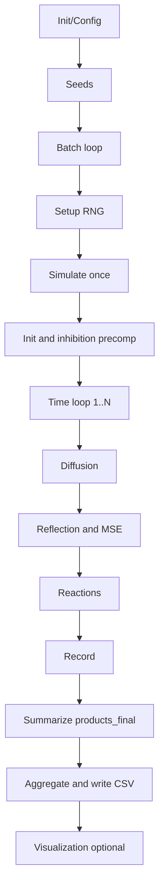

# 2D Enzyme Cascade Simulation: Mathematical Theory and Simulation Methods Analysis

Language: [English](2d_model_theory.en.md) | [中文](2d_model_theory.md)

> This document systematically presents the physical modeling, mathematical equations, stochastic/Monte Carlo mechanisms, statistical convergence, and code implementation mapping of the current 2D enzyme cascade simulation, facilitating reproduction, review, and extension.

- Main Control Entry and Batch Processing:
  - [2D/main_2d_pipeline.m](../main_2d_pipeline.m)
  - [2D/modules/batch/run_batches.m](../modules/batch/run_batches.m)
  - [2D/modules/seed_utils/get_batch_seeds.m](../modules/seed_utils/get_batch_seeds.m)
- Single Simulation and Core Physics:
  - [2D/modules/sim_core/simulate_once.m](../modules/sim_core/simulate_once.m)
  - [2D/modules/sim_core/init_positions.m](../modules/sim_core/init_positions.m)
  - [2D/modules/sim_core/diffusion_step.m](../modules/sim_core/diffusion_step.m)
  - [2D/modules/sim_core/boundary_reflection.m](../modules/sim_core/boundary_reflection.m)
  - [2D/modules/sim_core/reaction_step.m](../modules/sim_core/reaction_step.m)
  - [2D/modules/sim_core/precompute_inhibition.m](../modules/sim_core/precompute_inhibition.m)
  - [2D/modules/sim_core/record_data.m](../modules/sim_core/record_data.m)
- Visualization (Event Maps/Trajectories, etc.):
  - [2D/modules/viz/plot_event_map.m](../modules/viz/plot_event_map.m)
  - [2D/modules/viz/plot_tracers.m](../modules/viz/plot_tracers.m)

---

## 1. System Overview and Modeling Assumptions

- Geometry and Boundaries
  - 2D square box with side length L (default 500 nm), containing a central particle with radius r_p (default 20 nm) and a film region with thickness f_t (default 5 nm).
  - Boundary conditions: Box walls and particle surface are specular reflective (no absorption).
- Species and Processes
  - Substrate S undergoes random diffusion; GOx and HRP are fixed in the film region (MSE mode) or distributed in bulk (bulk mode).
  - Cascade reaction: S -(GOx)-> I -(HRP)-> P.
  - Key Parameters (default values in configuration):
  - Diffusion coefficients: D_bulk = 1000 nm²/s, D_film = 10 nm²/s.
  - Rate constants: k_cat,GOx = 100 s⁻¹, k_cat,HRP = 100 s⁻¹.
  - Crowding inhibition: Range R_inhibit = 10 nm, saturation threshold n_sat = 5, maximum inhibition I_max = 0.8.
- Configuration Entry
  - [2D/modules/config/default_config.m](../modules/config/default_config.m)
  - [2D/modules/config/interactive_config.m](../modules/config/interactive_config.m)

---

## 2. Continuum Model (PDE Perspective)

The reaction-diffusion equations in 2D space (qualitative display):

**Reaction-Diffusion System**
- ∂[S]/∂t = D ∇²[S] - k_GOx [S][GOx]
- ∂[I]/∂t = D ∇²[I] + k_GOx [S][GOx] - k_HRP [I][HRP]
- ∂[P]/∂t = D ∇²[P] + k_HRP [I][HRP]

Explanation:

- ∇² = ∂²/∂x² + ∂²/∂y².
- In MSE mode, [GOx] and [HRP] are effectively concentrated in the film annular region r ∈ [r_p, r_p + f_t], appearing as strongly non-uniform source terms.

---

## 3. Stochastic Particle Simulation (Monte Carlo BD + Event-Driven)

This model uses Brownian Dynamics for discrete diffusion, combined with fixed-step stochastic reaction determination (τ-leaping approximation).

### 3.1 Diffusion Discretization (Brownian Step)

- Theory:

**Brownian Step Formula**:
Δr = sqrt(2 D Δt) · η, where η ~ N(0, I₂)

- Code correspondence: Gaussian displacement is superimposed on particle positions (D chosen based on bulk/film).
- File: [2D/modules/sim_core/diffusion_step.m](../modules/sim_core/diffusion_step.m)

### 3.2 Boundary and Film Region Constraints

- Box and particle surface specular reflection: Normal component is reversed.
- MSE mode: Reaction sites and feasible encounters are restricted to the film ring r ∈ [r_p, r_p + f_t].
- File: [2D/modules/sim_core/boundary_reflection.m](../modules/sim_core/boundary_reflection.m), film ring constraints in [2D/modules/sim_core/reaction_step.m](../modules/sim_core/reaction_step.m)

### 3.3 Reaction Probability and Event Sampling (Gillespie Style)

- Single-step reaction probability:

**Reaction Probability Formula**:
p = 1 - exp(-k_eff · Δt), where k_eff = k_cat (1 - inhibition)

- Determination: Sample u ~ U(0,1); if u < p, then a reaction event occurs (S→I or I→P).

- Event coordinates: Sampled and recorded near the encounter pair (enzyme-substrate) for event heatmaps.
- File: [2D/modules/sim_core/reaction_step.m](../modules/sim_core/reaction_step.m)

### 3.4 Crowding Inhibition (Local Modulation)

- Count local crowding degree n_local within neighbor radius R_inhibit, forming inhibition weight:

**Crowding Inhibition Formula**:
inhibition = I_max × max(0, 1 - n_local/n_sat)

- File: [2D/modules/sim_core/precompute_inhibition.m](../modules/sim_core/precompute_inhibition.m)

### 3.5 Data Accumulation and Time Integration

- Rates: r_GOx(t) = n_GOx,step / Δt; similarly r_HRP(t).
- Product curve: P(t) ≈ Σ r_HRP(t) · Δt.
- Snapshots/layering/trajectories are selectively recorded according to configuration.
- File: [2D/modules/sim_core/record_data.m](../modules/sim_core/record_data.m), summarized in [2D/modules/sim_core/simulate_once.m](../modules/sim_core/simulate_once.m)

---

## 4. Batch Monte Carlo Statistics and Convergence

- Single batch output: Final product count `products_final`, plus trajectories/events, etc.
- Multi-batch statistics: Run M times with independent seeds, estimate expectation and variance:

**Monte Carlo Statistics Formulas**:
- μ̂ = (1/M) Σ_{m=1}^{M} P_m
- Var(μ̂) = σ²/M

- Recommendations:
  - Validation/parameter tuning phase: M ≈ 5-10;
  - Reporting/interval estimation: M ≥ 30, and output mean ± confidence interval.
- File: [2D/modules/batch/run_batches.m](../modules/batch/run_batches.m), seed strategy in [2D/modules/seed_utils/get_batch_seeds.m](../modules/seed_utils/get_batch_seeds.m)

---

## 5. Code Implementation Flowchart (Logical Overview)

- Entry: [2D/main_2d_pipeline.m](../main_2d_pipeline.m)
- Single simulation: [2D/modules/sim_core/simulate_once.m](../modules/sim_core/simulate_once.m)

---

## 6. Code Mapping Quick Reference

- Main Control and IO
  - [2D/main_2d_pipeline.m](../main_2d_pipeline.m): Unified workflow, visualization, and reporting
  - [2D/modules/batch/run_batches.m](../modules/batch/run_batches.m): Batch loop and result aggregation
  - [2D/modules/seed_utils/get_batch_seeds.m](../modules/seed_utils/get_batch_seeds.m): Seed strategy
- Physics Core
  - [2D/modules/sim_core/simulate_once.m](../modules/sim_core/simulate_once.m): Single simulation facade
  - [2D/modules/sim_core/init_positions.m](../modules/sim_core/init_positions.m): Initial positions
  - [2D/modules/sim_core/diffusion_step.m](../modules/sim_core/diffusion_step.m): Brownian diffusion
  - [2D/modules/sim_core/boundary_reflection.m](../modules/sim_core/boundary_reflection.m): Boundary/particle reflection
  - [2D/modules/sim_core/reaction_step.m](../modules/sim_core/reaction_step.m): Reaction events and film ring constraints
  - [2D/modules/sim_core/precompute_inhibition.m](../modules/sim_core/precompute_inhibition.m): Crowding inhibition
  - [2D/modules/sim_core/record_data.m](../modules/sim_core/record_data.m): Rate/curve accumulation
- Visualization
  - [2D/modules/viz/plot_event_map.m](../modules/viz/plot_event_map.m): Spatial event maps
  - [2D/modules/viz/plot_tracers.m](../modules/viz/plot_tracers.m): Particle trajectories
  - Other plot_* files in `modules/viz/`

---

## 7. Terminology and Reference

- Brownian Dynamics: Discrete Wiener process simulation of diffusion through Δr = sqrt(2D Δt) η.
- Gillespie/τ-leaping: Fixed-step event probability approximation using p = 1 - exp(-k Δt).
- Smoluchowski Encounter Theory: Encounter rates for diffusion-controlled reactions, expressed differently in 2D/3D.
