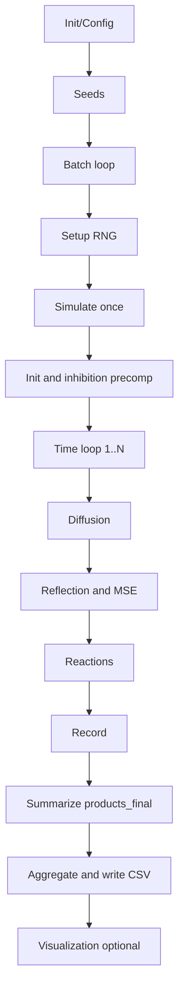

# 2D 酶级联模拟：数学理论与模拟方法解析
Language / 语言: [English](2d_model_theory.en.md) | [中文](2d_model_theory.md)

> 本文系统梳理当前 2D 酶级联模拟的物理建模、数学方程、随机数/蒙特卡洛机制、统计收敛与代码实现映射，便于复现、审阅与扩展。

- 主控入口与批处理：
  - [2D/main_2d_pipeline.m](../main_2d_pipeline.m)
  - [2D/modules/batch/run_batches.m](../modules/batch/run_batches.m)
  - [2D/modules/seed_utils/get_batch_seeds.m](../modules/seed_utils/get_batch_seeds.m)
- 单次模拟与核心物理：
  - [2D/modules/sim_core/simulate_once.m](../modules/sim_core/simulate_once.m)
  - [2D/modules/sim_core/init_positions.m](../modules/sim_core/init_positions.m)
  - [2D/modules/sim_core/diffusion_step.m](../modules/sim_core/diffusion_step.m)
  - [2D/modules/sim_core/boundary_reflection.m](../modules/sim_core/boundary_reflection.m)
  - [2D/modules/sim_core/reaction_step.m](../modules/sim_core/reaction_step.m)
  - [2D/modules/sim_core/precompute_inhibition.m](../modules/sim_core/precompute_inhibition.m)

  - [2D/modules/sim_core/record_data.m](../modules/sim_core/record_data.m)
- 可视化（事件图/轨迹等）：
  - [2D/modules/viz/plot_event_map.m](../modules/viz/plot_event_map.m) 
  - [2D/modules/viz/plot_tracers.m](../modules/viz/plot_tracers.m)

---

## 1. 系统概述与建模假设

- 几何与边界
  - 2D 方形盒子，边长 $L$（默认 $500\,\mathrm{nm}$），中心存在半径 $r_p$（默认 $20\,\mathrm{nm}$）的颗粒与膜厚 $f_t$（默认 $5\,\mathrm{nm}$）的环区。
  - 边界条件：盒壁、颗粒表面为镜面反射（无吸收）。
- 物种与过程
  - 底物 S 随机扩散；GOx、HRP 固定位于膜区（MSE 模式）或分布于体相（bulk 模式）。
  - 级联反应：$\mathrm{S} \xrightarrow{\mathrm{GOx}} \mathrm{I} \xrightarrow{\mathrm{HRP}} \mathrm{P}$。
- 关键参数（默认值见配置）：
  - 扩散系数：$D_{\mathrm{bulk}} = 1000\,\mathrm{nm}^2/\mathrm{s}$，$D_{\mathrm{film}} = 10\,\mathrm{nm}^2/\mathrm{s}$。
  - 速率常数：$k_{\mathrm{cat,GOx}} = 100\,\mathrm{s}^{-1}$，$k_{\mathrm{cat,HRP}} = 100\,\mathrm{s}^{-1}$。
  - 拥挤抑制：范围 $R_{\mathrm{inhibit}} = 10\,\mathrm{nm}$，饱和阈值 $n_{\mathrm{sat}} = 5$，最大抑制 $I_{\max} = 0.8$。
- 配置入口
  - [2D/modules/config/default_config.m](../modules/config/default_config.m)
  - [2D/modules/config/interactive_config.m](../modules/config/interactive_config.m)

---

## 2. 连续体模型（PDE 视角）

反应-扩散方程在 2D 空间的形式（定性展示）：

$$
\frac{\partial [\mathrm{S}]}{\partial t} = D \nabla^2[\mathrm{S}] - k_{\mathrm{GOx}}[\mathrm{S}][\mathrm{GOx}] \\
\frac{\partial [\mathrm{I}]}{\partial t} = D \nabla^2[\mathrm{I}] + k_{\mathrm{GOx}}[\mathrm{S}][\mathrm{GOx}] - k_{\mathrm{HRP}}[\mathrm{I}][\mathrm{HRP}] \\
\frac{\partial [\mathrm{P}]}{\partial t} = D \nabla^2[\mathrm{P}] + k_{\mathrm{HRP}}[\mathrm{I}][\mathrm{HRP}]
$$

说明：

- $\nabla^2 = \frac{\partial^2}{\partial x^2} + \frac{\partial^2}{\partial y^2}$。
- 在 MSE 模式，$[\mathrm{GOx}]$ 与 $[\mathrm{HRP}]$ 等效集中在膜环区域（$r \in [r_p, r_p+f_t]$），呈强非均匀源项。
- 非线性、奇异边界导致解析解困难，因此采用随机粒子/蒙特卡洛方法进行数值近似。

---

## 3. 随机粒子模拟（蒙特卡洛 BD + 事件驱动）

本模型采用布朗动力学（Brownian Dynamics）离散扩散，配合固定步长的随机反应判定（τ-leaping 近似）。

### 3.1 扩散离散（Brownian step）

#### 理论

$$
\Delta \mathbf{r} = \sqrt{2\,D\,\Delta t}\,\boldsymbol{\eta},\quad \boldsymbol{\eta} \sim \mathcal{N}(\mathbf{0}, \mathbf{I}_2)
$$

代码对应：高斯位移叠加到粒子位置（bulk/film 选择 D）。

文件： [2D/modules/sim_core/diffusion_step.m](../modules/sim_core/diffusion_step.m)

### 3.2 边界与膜区约束

- 盒子与颗粒表面镜面反射：法向分量取反。
- MSE 模式：反应位点与可行相遇被限制在膜环 $r \in [r_p, r_p + f_t]$。
- 文件： [2D/modules/sim_core/boundary_reflection.m](../modules/sim_core/boundary_reflection.m)，膜环约束在 [2D/modules/sim_core/reaction_step.m](../modules/sim_core/reaction_step.m)

### 3.3 反应概率与事件采样（Gillespie 风格）

#### 单步反应概率

$$
p = 1 - e^{-k_{\mathrm{eff}}\,\Delta t},\qquad k_{\mathrm{eff}} = k_{\mathrm{cat}}\bigl(1 - \mathrm{inhibition}\bigr)
$$

判定：采样 $u \sim \mathcal{U}(0,1)$，若 $u < p$，则发生反应事件（$\mathrm{S}\!\to\!\mathrm{I}$ 或 $\mathrm{I}\!\to\!\mathrm{P}$）。

事件坐标：在相遇对（酶-底物）局部附近采样并记录，用于事件热力图。

文件： [2D/modules/sim_core/reaction_step.m](../modules/sim_core/reaction_step.m)

### 3.4 拥挤抑制（局部调制）

近邻半径内（$R_{\text{inhibit}}$）统计局部拥挤度 $n_{\text{local}}$，形成抑制权重：

$$
\mathrm{inhibition} = I_{\max}\,\max\!\left(0,\, 1 - \frac{n_{\mathrm{local}}}{n_{\mathrm{sat}}}\right).
$$

文件： [2D/modules/sim_core/precompute_inhibition.m](../modules/sim_core/precompute_inhibition.m)

### 3.5 数据累计与时间积分

- 速率：

$$
r_{\mathrm{GOx}}(t) = \frac{n_{\mathrm{GOx,step}}}{\Delta t},\qquad
r_{\mathrm{HRP}}(t) = \frac{n_{\mathrm{HRP,step}}}{\Delta t}
$$

- 产物曲线：

$$
P(t) \approx \sum r_{\mathrm{HRP}}(t)\,\Delta t
$$

- 快照/分层/轨迹按配置选择性记录。

文件： [2D/modules/sim_core/record_data.m](../modules/sim_core/record_data.m)，汇总在 [2D/modules/sim_core/simulate_once.m](../modules/sim_core/simulate_once.m)

---

## 4. 批次蒙特卡洛统计与收敛

- 单批输出：最终产物数 `products_final`，以及轨迹/事件等。
- 多批统计：独立种子下运行 $M$ 次，估计期望与方差：

$$
\hat{\mu} = \frac{1}{M}\sum_{m=1}^M P_m,\qquad \mathrm{Var}(\hat{\mu}) = \frac{\sigma^2}{M}.
$$

- 建议：

  - 验证/调参阶段：$M\approx 5-10$；
  - 报告/区间估计：$M\ge 30$，并输出均值 $\pm$ 置信区间。

- 文件： [2D/modules/batch/run_batches.m](../modules/batch/run_batches.m)，种子策略见 [2D/modules/seed_utils/get_batch_seeds.m](../modules/seed_utils/get_batch_seeds.m)

---

## 5. 代码实现流程图（逻辑总览）

- 入口： [2D/main_2d_pipeline.m](../main_2d_pipeline.m)  
- 单次模拟： [2D/modules/sim_core/simulate_once.m](../modules/sim_core/simulate_once.m)

---

## 6. 代码映射速查

- 主控与 IO
  - [2D/main_2d_pipeline.m](../main_2d_pipeline.m)：统一流程、可视化与报表
  - [2D/modules/batch/run_batches.m](../modules/batch/run_batches.m)：批次循环与结果聚合
  - [2D/modules/seed_utils/get_batch_seeds.m](../modules/seed_utils/get_batch_seeds.m)：种子策略
- 物理核心
  - [2D/modules/sim_core/simulate_once.m](../modules/sim_core/simulate_once.m)：单次模拟门面
  - [2D/modules/sim_core/init_positions.m](../modules/sim_core/init_positions.m)：初始位置
  - [2D/modules/sim_core/diffusion_step.m](../modules/sim_core/diffusion_step.m)：布朗扩散
  - [2D/modules/sim_core/boundary_reflection.m](../modules/sim_core/boundary_reflection.m)：边界/颗粒反射
  - [2D/modules/sim_core/reaction_step.m](../modules/sim_core/reaction_step.m)：反应事件与膜环约束
  - [2D/modules/sim_core/precompute_inhibition.m](../modules/sim_core/precompute_inhibition.m)：拥挤抑制
  - [2D/modules/sim_core/record_data.m](../modules/sim_core/record_data.m)：速率/曲线累计
- 可视化
  - [2D/modules/viz/plot_event_map.m](../modules/viz/plot_event_map.m)：空间事件图
  - [2D/modules/viz/plot_tracers.m](../modules/viz/plot_tracers.m)：粒子轨迹
  - 其它 plot_* 见 `modules/viz/`

---

## 7. 术语与参考

- Brownian Dynamics（布朗动力学）：通过 $\Delta r = \sqrt{2D\Delta t}\cdot\eta$ 离散维纳过程模拟扩散。
- Gillespie/τ-leaping：固定步长下用 $p=1-\exp(-k\Delta t)$ 近似事件发生概率。
- Smoluchowski 相遇理论：扩散控制反应的相遇率，在 2D/3D 下表达不同。